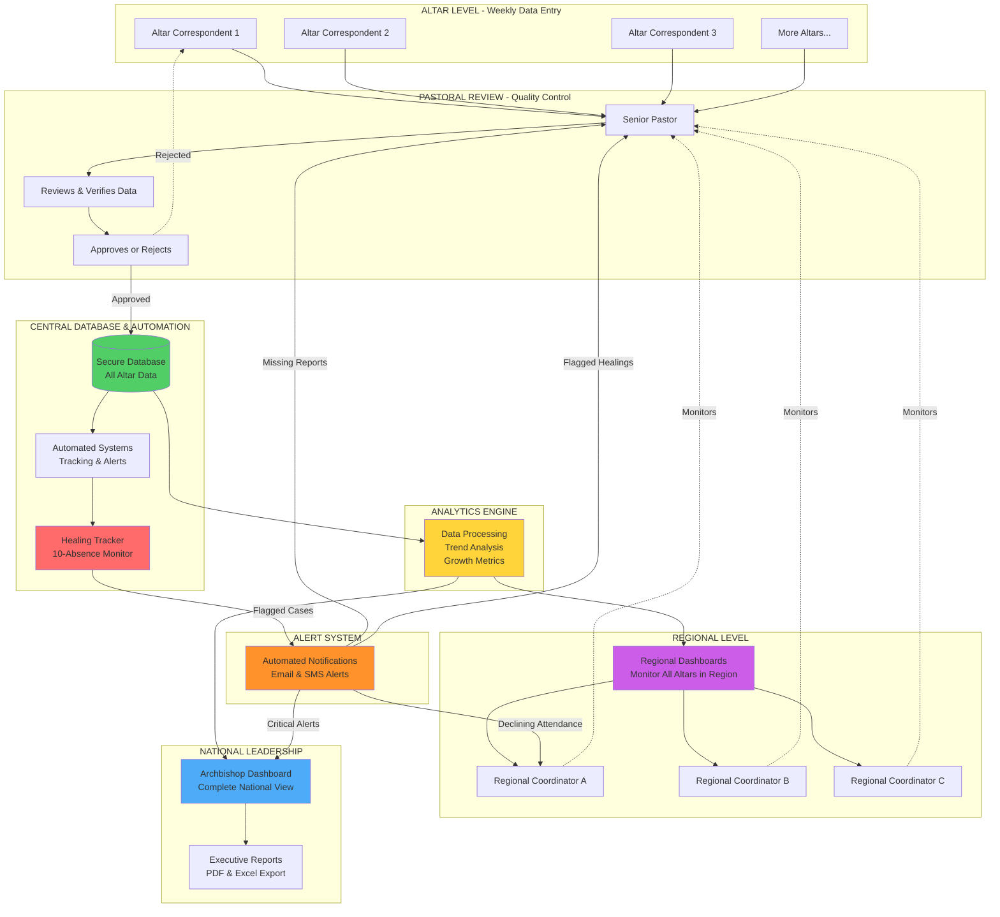
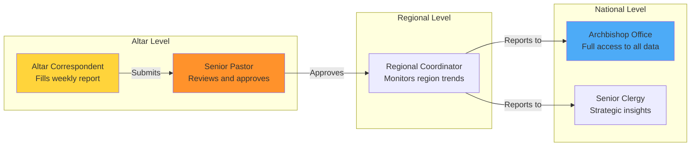
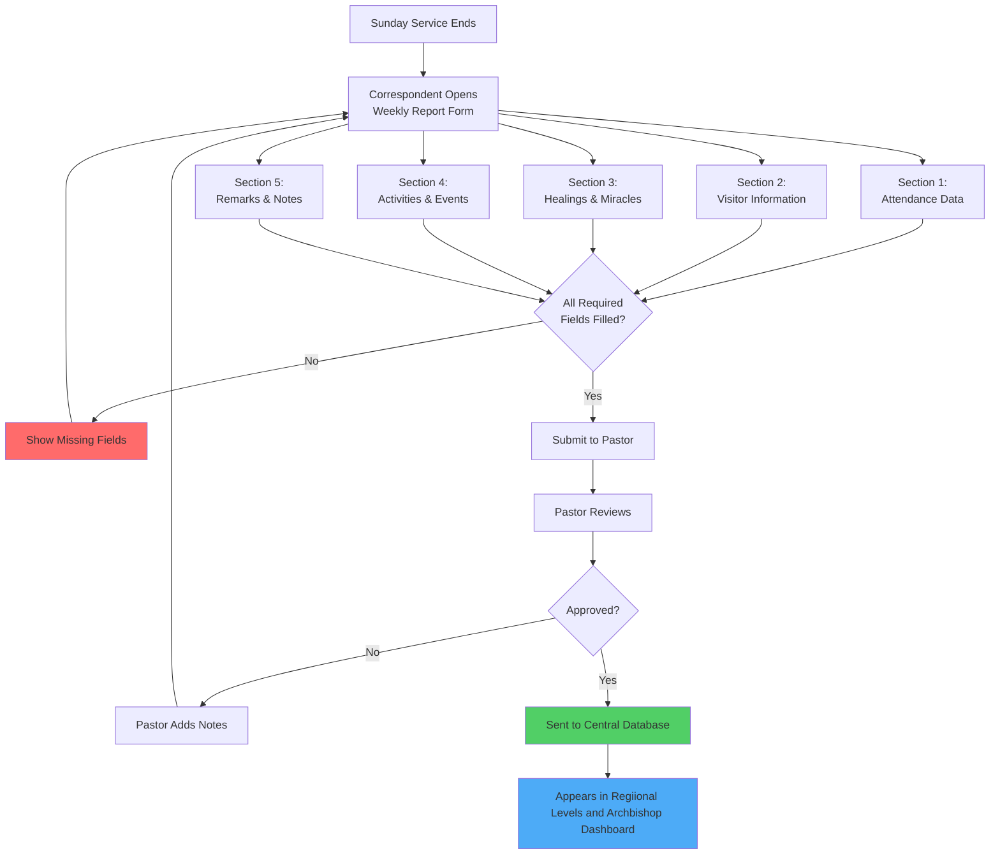
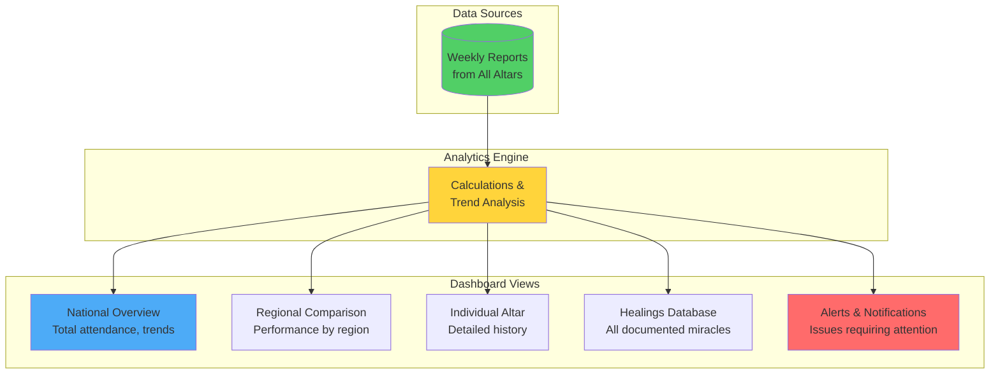
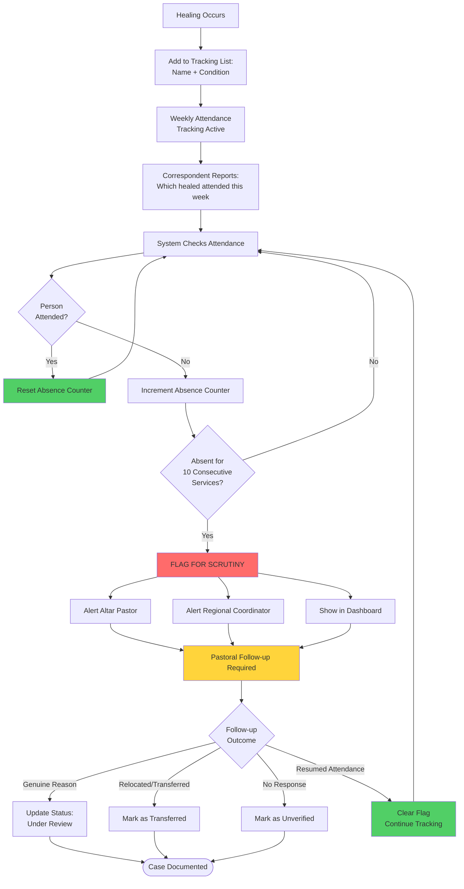
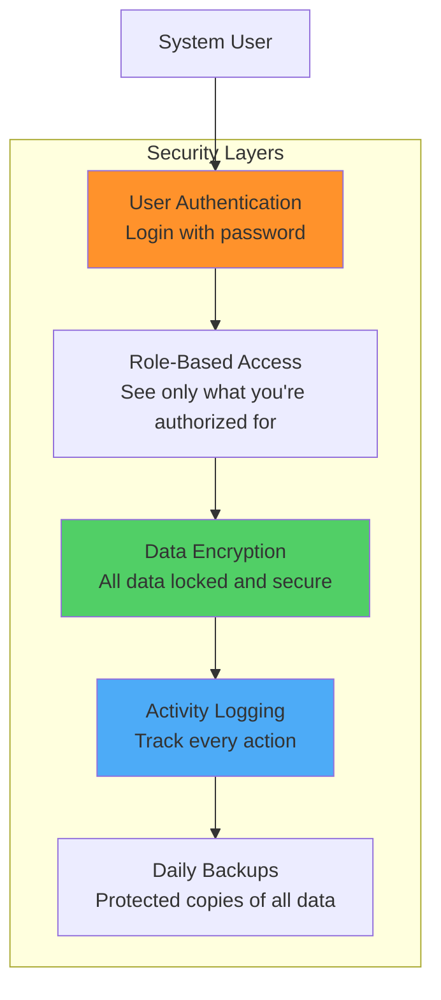

# Altar Reporting System - Project Objectives

## Executive Summary

The Altar Reporting System is a secure, internal web platform that enables all local altars (churches) globally to submit weekly reports directly to the Mightiest Prophets and Archbishop's office. This system enhances manual reporting processes with a streamlined digital solution that provides real-time insights, trend analysis, and strategic decision-making capabilities for ministry leadership.

**Primary Goal**: Empower ministry leadership with accurate, timely data from every altar to make informed decisions about resource allocation, pastoral support, and revival planning.

---

## System Overview - Complete Data Flow

### Detailed System Components

#### 1️⃣ **Altar Level - Data Entry**

- Correspondents fill weekly reports with:
  - Attendance numbers (men, women, children, youth)
  - Visitor information and conversions
  - Healed individuals attendance tracking
  - Activities and outreach counts

#### 2️⃣ **Pastoral Review - Quality Control**

- Senior Pastors review all submissions
- Verify accuracy of numbers
- Add pastoral remarks
- Approve or reject reports

#### 3️⃣ **Central Database & Automation**

- **Secure PostgreSQL Database**: Encrypted storage of all data
- **Automated Systems**: Background tasks for tracking and calculations
- **Healing Tracker**: Monitors attendance of all healed individuals
  - Counts consecutive absences
  - Auto-flags at 10 absences
  - Generates follow-up lists

#### 4️⃣ **Analytics Engine**

- Processes all approved data
- Calculates trends and growth rates
- Identifies performance metrics
- Detects declining altars
- Generates statistical insights

#### 5️⃣ **Regional Level**

- **Regional Coordinators**: Oversee 20-30 altars per region
- **Regional Dashboards** display:
  - All altars in their region
  - Regional attendance trends
  - Top performing altars
  - Altars needing support
  - Regional healing statistics
  - Comparison between altars

#### 6️⃣ **National Leadership**

- **Archbishop Dashboard** shows:
  - All altars nationwide
  - Total attendance trends
  - National growth rate
  - Visitor conversion rates
  - All healings tracked
  - All flagged cases
  - Regional comparisons
  - System-wide alerts
  - Performance Metrics
  - Statistical insights
  - And so much more ......
- **Executive Reports**: PDF/Excel exports for leadership meetings

#### 7️⃣ **Alert System**

- **Automated notifications** sent for:
  - Missing weekly reports
  - Healed individuals flagged (10+ absences)
  - Declining attendance patterns
  - Regional performance issues
  - Critical system-wide alerts
- **Delivery methods**: Email, SMS, Dashboard warnings

---

## Core Objectives

### 1. Streamline Weekly Reporting Process

**Current Challenge**: Manual reporting via phone, email, or WhatsApp is slow, inconsistent, and difficult to compile.

**Solution**: A single web platform where altar correspondents can submit standardized weekly reports in minutes.

**Success Metric**: 80%+ of altars reporting consistently every week within 3 months of launch.

---

### 2. Ensure Data Quality and Accountability

**Current Challenge**: Incomplete or unverified reports make it difficult to track ministry impact.

**Solution**: Built-in validation, pastor approval workflow, and required fields ensure every report is complete and accurate.

**Success Metric**: 95%+ of submitted reports marked as "complete" with all required information.

---

### 3. Provide Real-Time Ministry Insights

**Current Challenge**: Leadership decisions are based on delayed or incomplete information.

**Solution**: Live dashboards show attendance trends, visitor retention, healing reports, and altar performance across all regions.

**Success Metric**: Leadership can view current week's data within 24 hours of Sunday service.

---

### 4. Identify Growth Opportunities and Challenges

**Current Challenge**: Declining altars or struggling regions go unnoticed until it's too late.

**Solution**: Automated alerts and trend analysis highlight altars needing support or celebrating growth.

**Success Metric**: Early identification of 100% of declining altars with >20% attendance drop over 4 weeks.

---

### 5. Document Healings and Miracles

**Current Challenge**: Healing testimonies are not consistently tracked, and there's no system to verify the permanence of healings through continued church attendance.

**Solution**: Weekly attendance tracking of all healed individuals (name and condition recorded each service). System automatically flags healed individuals who miss 10 consecutive services for pastoral follow-up and verification.

**Success Metric**: 90%+ of healed individuals maintaining regular attendance; 100% of flagged cases reviewed within 2 weeks; 100% attendance accuracy for all healed of the LORD.

Recommendation: We might in future need a standalone app for Healings and testimonies tracking, with more features.

---

### 6. Maintain Security and Privacy

**Current Challenge**: Sensitive church data must be protected from unauthorized access.

**Solution**: Role-based access control, encrypted data storage, and comprehensive audit logging.

**Success Metric**: Zero unauthorized data access incidents; 100% compliance with security protocols.

---

## User Roles and Responsibilities

### Role Definitions

| Role                           | Permissions                                   | Responsibilities                                                       |
| ------------------------------ | --------------------------------------------- | ---------------------------------------------------------------------- |
| **Altar Correspondent**  | Submit reports for their altar only           | Fill weekly form with attendance, visitors, healings, events           |
| **Senior Pastor**        | Review and approve reports for their altar    | Verify accuracy, add remarks, approve before submission                |
| **Regional Coordinator** | View all altars in their region               | Monitor trends, support struggling altars, celebrate growth            |
| **Archbishop Office**    | Full system access, all reports and analytics | Review national (global) trends, make strategic decisions, export data |

---

## Weekly Report Data Collection

A general overview, but not final, architecture of the flow of the app.

### Report Sections

#### 1. Attendance Data (Required)

- Total registered members at this altar
- Sunday main service attendance count
- Men's attendance count
- Women's attendance count
- Children's service attendance
- Youth service attendance
- Number of absentees (if tracked)
- Attendance percentage (auto-calculated)

#### 2. Visitor Information (Required)

- Number of first-time visitors
- Number of returning visitors
- Visitor names and contact information (optional for follow-up)
- Visitor origin by location (local/regional/international)
- Number of visitors who indicated interest in joining
- Number of visitors who committed their lives to Christ

#### 3. Healed of the LORD - Attendance Tracking (Required)

- **Number of healed individuals who attended this service**
- Name of each healed person present
- Condition they were healed from (category: cancer, HIV, paralysis, blindness, deaf, lame, tumor, etc.)

**Purpose**: Track consistent attendance of all healed individuals to verify the permanence and authenticity of healing testimonies.

**Automatic Tracking**: The system automatically monitors attendance of all healed individuals. If a healed person fails to attend 10 consecutive services, they are automatically flagged for scrutiny and pastoral follow-up.

**Note**: New healings may also be reported here when they occur, but the primary focus is tracking attendance of all previously healed individuals.

#### 4. Activities & Events (Optional)

- Number of house visitations conducted
- Number of Bible studies held
- Number of community outreach activities
- Number of people reached through outreach
- Number of prayer meetings held
- Number of new converts/salvations

#### 5. Remarks & Statistical Notes (Optional)

- Correspondent's observations
- Notable trends or changes observed
- Prayer requests
- Support needed
- Celebrations and milestones
- Any additional numerical data or context

**Note**: The system focuses on collecting quantifiable data (numbers, counts, percentages) to enable accurate trend analysis and strategic decision-making. Detailed statistical reporting takes priority over media uploads.

---

## Dashboard & Analytics Features

### Key Metrics Displayed

**National Dashboard:**

- Total members across all altars
- Total attendance this week vs. last week (with % change)
- Total visitors nationwide (first-time vs. returning)
- Visitor conversion rate (visitors who joined)
- Salvation count (new converts this week/month)
- Growth rate (monthly, quarterly, yearly with trend graphs)
- Total healings reported this month (by category)
- Healed individuals attendance rate (% attending regularly)
- **Flagged healings** (individuals missing 10+ consecutive services)
- Total outreach activities conducted
- Average attendance per altar
- Reporting compliance (% of altars reporting on time)

**Regional Dashboard:**

- Total attendance by region (with weekly/monthly trends)
- Regional growth rate comparison (% change)
- Top performing altars (by growth %, attendance, conversions)
- Altars needing support (declining attendance, low visitor count)
- Regional salvation statistics
- Regional healing count by category
- **Regional healing attendance rate** (% of healed maintaining attendance)
- **Flagged healings by altar** requiring verification
- Average visitors per altar in region

**Individual Altar Dashboard:**

- 52-week attendance history graph with trend line
- Member retention rate (%)
- Visitor statistics (total, conversion rate, return rate)
- Healing count by category and date
- **Healed individuals list** with attendance tracking status
- **Alerts for healed individuals** missing 10+ consecutive services
- Growth metrics (weekly, monthly, quarterly %)
- Outreach activity count and impact
- Historical comparison with previous years
- Pastor remarks history

---

## Healing Verification Through Attendance Tracking

### Purpose of Attendance-Based Verification

**Why Track Weekly Attendance of All Healed Individuals?**

1. **Verify Permanence of Healings**: Continued church attendance demonstrates sustained healing and transformation
2. **Pastoral Accountability**: Ensures healed individuals are spiritually supported and integrated into church life
3. **Data Integrity**: Prevents false or exaggerated healing claims that cannot be sustained over time
4. **Follow-up Care**: Identifies healed individuals who may need additional support or counseling
5. **Statistical Accuracy**: Provides honest metrics about healing outcomes and retention
6. **Historical Record**: Creates a comprehensive database of verified healings with long-term attendance proof

**How the System Works:**

1. When a healing occurs, the person's name and condition are added to a special tracking list for that altar
2. **Every week**, the correspondent reports which healed individuals attended service
3. The system automatically updates:
   - If they attended: the absence counter resets to zero ✅
   - If they're absent: the counter increases by one ⚠️
4. After 10 consecutive absences, the system automatically:
   - Flags the case in red on all dashboards 🚨
   - Sends automatic alerts to the altar pastor and regional coordinator
   - Requires a follow-up investigation and status update
5. The correspondent simply checks off names of healed people present each week - the system handles all tracking automatically

**Follow-up Actions:**

- Pastor contacts the individual to understand their situation
- Possible outcomes documented: Relocated, illness, backsliding, false claim, genuine ongoing healing
- Case remains flagged until pastoral review is completed and status updated
- Historical data preserved for statistical analysis and learning

**Benefits:**

- ✅ Maintains integrity of healing testimonies
- ✅ Ensures pastoral care for all healed individuals
- ✅ Provides honest data about long-term healing outcomes
- ✅ Identifies patterns (e.g., certain conditions with better retention)
- ✅ Enables proactive intervention before someone falls away completely

---

## Technical Features

### User-Friendly Design:

**User-Friendly Design:**

- Simple forms that work on any device (phone, tablet, computer)
- Step-by-step guidance for first-time users
- Save draft reports and complete later
- Auto-calculated totals and statistics

**Reliability:**

- Works offline if internet is unstable (saves and submits when connected)
- Automatic data backup every day
- 99.9% uptime guarantee

**Security:**

- Each user has unique login credentials
- Data encrypted (locked) so only authorized people can access
- Complete activity log showing who accessed what and when
- Regular security audits

### Technical Architecture:

**Technology Stack:**

- **Frontend**: React/Next.js with responsive design
- **Backend**: Django REST API with automated task scheduling
- **Database**: PostgreSQL with daily automated backups
- **Authentication**: JWT with multi-factor authentication option
- **Hosting**: Cloud-based (AWS/GCP) with auto-scaling
- **Security**: AES-256 encryption, RBAC, SSL/TLS, audit logging
- **Automation**: Celery/Redis for background tasks (attendance tracking, alert generation)

**Performance:**

- Response time: <2 seconds for all operations
- Concurrent users: Support 500+ simultaneous users
- Data retention: Permanent storage with 7-year archived backup
- **Automated Tasks**: Daily attendance checks, weekly alert generation, monthly trend reports

**Key Automated Features:**

- Automatic attendance tracking for healed individuals
- Auto-flagging after 10 consecutive absences
- Automatic alert notifications to pastors
- Auto-calculated statistics and percentages
- Scheduled weekly reminder emails for report submission

---

## Security & Privacy Measures

**Key Security Features:**

1. **Private System**: Not accessible from public internet without login
2. **Individual Accounts**: Each user has unique credentials
3. **Limited Access**: Users only see data relevant to their role
4. **Encrypted Storage**: All data protected even if physical servers compromised
5. **Audit Trail**: Complete record of who accessed what and when
6. **Regular Backups**: Daily automated backups stored in secure location
7. **Healing Data Privacy**: Names of healed individuals only visible to authorized pastoral staff; strict confidentiality maintained

---

## Implementation Phases

Duration is total estimate

### Phase 1: Foundation (Months 1-2)

- System design and architecture
- User role definition and workflow mapping
- Database schema design
- Security framework setup

### Phase 2: Development (Months 2-4)

- Core reporting forms development
- Dashboard and analytics engine
- User authentication and access control
- Testing with pilot group (5-10 altars)

### Phase 3: Training & Rollout (Months 4-5)

- User training materials (videos, guides)
- Train correspondents and pastors
- Gradual rollout to all altars (region by region)
- Support desk establishment

### Phase 4: Optimization (Month 6+)

- Gather user feedback
- Feature enhancements
- Performance optimization
- Advanced analytics development

---

## Success Metrics

| Metric                                            | Target                                 | Timeline                        |
| ------------------------------------------------- | -------------------------------------- | ------------------------------- |
| Altar participation rate                          | 80%+ reporting weekly                  | 3 months post-launch            |
| Report completion quality                         | 95%+ complete reports                  | 2 months post-launch            |
| Data entry time per report                        | <10 minutes average                    | Immediate                       |
| System uptime                                     | 99.9%                                  | Continuous                      |
| User satisfaction score                           | 4.5/5 stars                            | 6 months post-launch            |
| Leadership decision response time                 | 50% faster                             | 3 months post-launch            |
| **Healed individuals attendance tracking**  | **100% accuracy weekly**         | **Continuous**            |
| **Healed individuals attendance rate**      | **85%+ attending regularly**     | **Continuous**            |
| **Flagged healings follow-up rate**         | **100% reviewed within 2 weeks** | **Continuous**            |
| **Healing verification through attendance** | **90%+ verified as permanent**   | **12 months post-launch** |

---

## Benefits Summary

### For Altar Correspondents:

✅ Fast, simple reporting (10 minutes vs. 30+ minutes manual)
✅ Works on any device, no special software needed
✅ Automatic reminders so you never miss a report
✅ Save drafts and complete later if interrupted
✅ Auto-calculated totals and percentages reduce manual math
✅ Focus on numbers and statistics, not complex media uploads

### For Pastors:

✅ Quick review and approval process
✅ Track your altar's growth over time
✅ Easy access to historical data for planning
✅ Celebrate milestones with visual reports
✅ **Automatic alerts when healed individuals miss 10+ services**
✅ **Proactive pastoral care enabled through attendance monitoring**
✅ **Maintain credibility through verified healing testimonies**

### For Regional Coordinators:

✅ Real-time visibility into all altars in your region
✅ Identify struggling altars early for intervention
✅ Share best practices from high-performing altars
✅ Data-driven resource allocation

### For Archbishop Office:

✅ Complete national overview at a glance
✅ Make strategic decisions based on real data
✅ Generate reports for leadership meetings in seconds
✅ Document ministry impact with credible statistics
✅ Track fulfillment of prophecies and revival growth
✅ **Automatic verification of healing testimonies through attendance tracking**
✅ **Early alerts for healed individuals requiring pastoral follow-up**
✅ **Maintain integrity and credibility of healing claims**

---

## Implementation Roadmap

### Phase 1: Foundation (Months 1-2)

- System design and architecture finalization
- Requirements gathering from pilot altars
- Technology stack confirmation
- Budget allocation and resource planning

### Phase 2: Development (Months 2-4)

- Development team assembly
- Core system development
- Database and security implementation
- Initial testing with pilot group

### Phase 3: Rollout (Months 4-6)

- User training program
- Gradual deployment to all altars
- Support system establishment
- Continuous feedback and refinement

### Phase 4: Optimization (Month 6+)

- Performance monitoring
- Feature enhancements
- Advanced analytics deployment
- Full system optimization

---

## Conclusion

The Altar Reporting System transforms weekly church reporting from a manual, time-consuming process into a streamlined, data-driven operation that empowers ministry leadership with real-time insights. By combining ease of use for correspondents with powerful analytics for leadership, this system will enable better decision-making, faster response to challenges, and comprehensive documentation of God's mighty works across all altars nationwide.

**Unique Feature**: The automated healing verification through attendance tracking ensures every healing testimony is substantiated by sustained church participation, maintaining the integrity and credibility of documented miracles while enabling proactive pastoral care.

**Project Vision**: Every altar reporting consistently, leadership equipped with timely data, verified healing testimonies with proven permanence, and a permanent historical record of ministry growth and impact.

---

*"Where there is no vision, the people perish: but he that keepeth the law, happy is he." - Proverbs 29:18*

**Document Version**: 1.0
**Date**: February 12, 2026
**Ministry of Repentance and Holiness**
