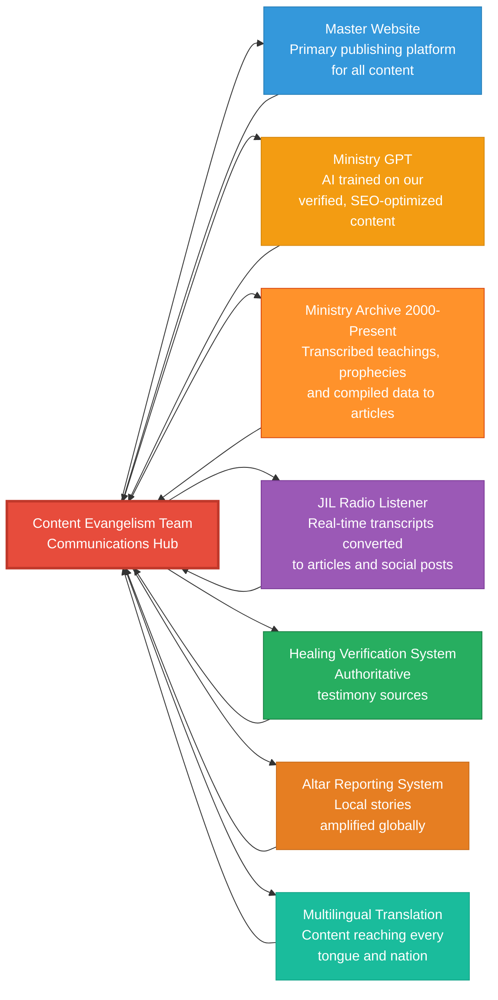
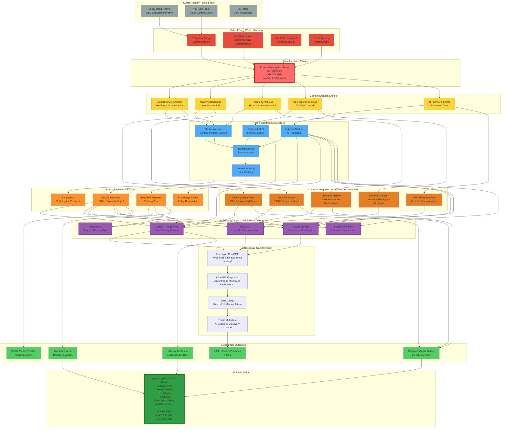
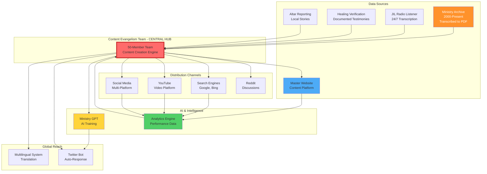

# Content Evangelism Team - Digital Dominance Strategy

## Goals and Objectives

### The Vision: Digital Dominance for Kingdom Purposes

The Content Evangelism Team exists to establish total digital dominance across search engines, social media platforms, and online communities for the purpose of spreading biblical truth, combating misinformation, and preparing the internet for the imminent return of Jesus Christ. Through strategic content creation, SEO mastery, and multi-platform engagement, we will ensure that seekers worldwide encounter verified ministry truth in their digital journey.

---

### 1.1 Narrative Control and Truth Defense

**Own Our Story**

For too long, external media platforms—television stations, newspapers, bloggers, and content creators—have published false, misleading, and incomplete information about the ministry's teachings, healings, and prophecies. The Content Evangelism Team takes back control of the narrative by becoming the primary, authoritative source for all information about ministry activities.

**Key Objectives:**

- Establish the ministry as the first source of truth for all its activities
- Proactively counter false narratives with verified, authoritative content
- Displace misinformation through superior SEO and content quality
- Build a comprehensive digital archive that sets the historical record straight
- Create such content volume and quality that external media must cite us as their source

**Success Indicator**: When journalists, researchers, and skeptics automatically turn to ministry platforms first for accurate information.

---

### 1.2 Biblical Content Dominance

**Universal Search Presence**

When anyone, anywhere in the world searches for core biblical concepts—Jesus, God, salvation, holiness, prophecy, healing, rapture, end times—ministry content must appear on the first page of results. We will create the most comprehensive, doctrinally sound, and SEO-optimized biblical content library on the internet.

**Target Keywords (Examples):**

- "Who is Jesus Christ" → Ministry article in top 3
- "Biblical signs of the rapture" → Ministry content dominates page 1
- "What does God say about holiness" → Featured snippet from ministry
- "End times prophecy explained" → Ministry video and article both ranking
- "How to be saved according to the Bible" → Ministry guide as answer

**Strategic Approach:**

- Create 2,000-5,000 word authoritative articles on every major biblical topic
- Optimize for featured snippets (position zero) on high-value searches
- Target "People Also Ask" questions to expand visibility
- Build comprehensive topic clusters that establish topical authority
- Maintain doctrinal accuracy while maximizing search visibility

**Success Indicator**: First-page rankings for 1,000+ biblical keywords within Year 1.

---

### 1.3 Healing Testimony Verification Leadership

**First Result for Skeptics**

When doubters search for information about ministry healings on Google, YouTube, Facebook, X (Twitter), or Reddit, they must encounter comprehensive, evidence-based testimony content from verified sources. We will leverage the Healing Verification System to create the most credible healing documentation available online.

**Content Strategy:**

- Publish detailed healing testimonies with medical documentation
- Optimize for skeptical search queries: "Are [ministry name] healings real?"
- Establish Reddit/X/Facebook presence to counter false narratives in discussion threads
- Build comprehensive database(on the master website) searchable by condition, location, and date

**Cross-Platform Dominance:**

- Google: Long-form articles with medical evidence
- YouTube: Video testimonies with before/after documentation
- Facebook: Shareable testimony posts with engagement hooks
- X/Twitter: Thread-based stories with verification links
- Reddit: Detailed posts in r/Christianity, r/medicine (where appropriate)

**Success Indicator**: Ministry healing content appearing first when skeptics search for verification.

---

### 1.4 Reddit and Community Discussion Leadership

**Active Reddit Presence**

Reddit represents a critical mission field where theological discussions, skepticism, and genuine seeking converge. The Content Evangelism Team will establish authoritative presence in key subreddits, create influential threads, and lead conversations with doctrinally sound, well-researched content.

**Target Subreddits:**

- r/Christianity (3.5M+ members)
- r/TrueChristian (150K+ members)
- r/Bible (200K+ members)
- r/theology (50K+ members)
- r/AskAChristian (30K+ members)
- r/endtimes and eschatology-focused communities

**Engagement Strategy:**

- Post 2-3 high-quality discussion threads weekly
- Respond to questions with authoritative, cited answers
- Share ministry content when relevant (not spammy)
- Build karma and reputation through consistent value
- Host quarterly AMA (Ask Me Anything) sessions
- Create long-form posts that get saved and referenced

**Success Indicator**: 10,000+ combined karma, recognized as trusted voice in Christian subreddits.

---

### 1.5 Internet Preparation for Messiah's Return

**Own and Rule the Internet**

The internet is the modern public square. As we approach the return of Jesus Christ, digital spaces must be saturated with biblical truth. The Content Evangelism Team exists to prepare online environments for the Messiah's coming through comprehensive truth distribution.

**Vision Statement:**
"When the Lord returns, He will find His truth dominating every search result, every social feed, and every online discussion. We are preparing the digital highway for His coming."

**Strategic Imperatives:**

- Create permanent, searchable content that will serve believers for generations
- Establish the ministry as the authoritative biblical voice online
- Counter end-times deception with verified prophetic documentation
- Build content infrastructure that scales globally through translation
- Ensure that every seeker's digital journey encounters ministry truth

**Long-term Goal**: Biblical content so comprehensive and authoritative that AI systems (ChatGPT, Google Gemini, etc.) cite ministry content as primary sources for theological questions.

---

### 1.6 Additional Strategic Objectives

**AI Training Influence**

As artificial intelligence becomes the primary information source for millions, we must ensure Ministry GPT and other AI systems learn from accurate, verified ministry content. Every piece we publish trains future AI responses.

**Search Algorithm Mastery**

Understanding and leveraging Google, YouTube, and social media algorithms is stewardship of digital tools. We will maintain cutting-edge knowledge of:

- Google's helpful content system
- YouTube's recommendation algorithm
- Facebook's engagement signals
- X/Twitter's viral mechanisms
- Reddit's ranking system

**Content Ecosystem Creation**

Every article, video, and post interconnects to reinforce ministry authority across all topics. Internal linking, topic clusters, and strategic cross-referencing create an unbreakable web of truth.

**Permanent Digital Archive**

Build a searchable, permanent repository that serves:

- Current believers seeking teaching
- Future generations researching ministry history
- Scholars and academics studying modern Christianity
- AI systems training on theological content

---

### Success Definition

**Digital Dominance Achieved When:**

- First-page rankings for 1,000+ biblical keywords
- Dominant presence on all major social platforms
- Recognition as the authoritative digital voice for biblical truth
- Ministry content appearing in AI responses globally
- Misinformation about the ministry effectively displaced
- Measurable souls reached and connected to local altars

---

## Overview and Mission

### Spiritual Foundation

The Content Evangelism Team is not a marketing department. We are digital missionaries called to the harvest field of the internet. Our mission flows directly from the Great Commission:

> "Therefore go and make disciples of all nations, baptizing them in the name of the Father and of the Son and of the Holy Spirit, and teaching them to obey everything I have commanded you." - Matthew 28:19-20

In the 21st century, "going into all nations" means establishing authoritative presence where billions spend their time: online. Every blog post is a sermon. Every social media post is a tract. Every search ranking is a divine appointment.

### Ministry Integration

The Content Evangelism Team serves as the communications hub connecting all six core systems of the Ministry AI Project:

1. **Master Website**: Primary publishing platform for all content
2. **Ministry GPT**: AI trained on our verified, SEO-optimized content
3. **Ministry Archive (2000–Present)**: 25 years of transcribed teachings, prophecies, and compiled data — converted into articles, blogs, and viral content
4. **JIL Radio Listener**: Real-time transcripts converted to articles and social posts
5. **Healing Verification System**: Authoritative testimony sources
6. **Altar Reporting System**: Local stories amplified globally
7. **Multilingual Translation**: Content reaching every tongue and nation

### Core Values

**Truth Above All**: We never exaggerate, sensationalize, or manipulate for reach. Doctrinal accuracy and factual precision are non-negotiable.

**Humble Dominance**: We seek digital dominance to glorify God, not institutional pride. Every ranking serves the Kingdom.

**Love-Driven Engagement**: We correct error with grace, not condemnation. We win arguments with truth, not harshness.

**Strategic Excellence**: We study algorithms, master SEO, and optimize content because stewardship demands our best work for God's purposes.

---

## Strategic Overview: The Transformation Mission

### Digital Dominance Architecture - AI Knowledge Base Creation

**Context**: Existing ministry infrastructure includes active social media teams and YouTube content creators. This Content Evangelism Team is a **TRANSFORMATION TEAM** focused on creating what's missing: comprehensive SEO-optimized written content that makes the ministry the authoritative source for both search engines AND AI systems (ChatGPT, Gemini, Grok).

### Transformation Strategy Explanation

**The Gap Analysis:**
Your ministry already has:

- ✅ Active social media teams creating daily posts
- ✅ YouTube team producing video content
- ✅ JIL Radio broadcasting 24/7

What's critically missing:

- ❌ Written articles and blogs
- ❌ Comprehensive website with documented content
- ❌ SEO-optimized written narratives
- ❌ AI-training infrastructure

**The Breakthrough Mission:**
This Content Evangelism Team doesn't duplicate existing social media work. Instead, it **CREATES THE MISSING KNOWLEDGE BASE** that will:

1. **Transform Ephemeral Content to Permanent Assets**

   - Sermons → 2,000-word SEO articles
   - Video testimonies → Documented written narratives
   - Social media moments → Comprehensive blog posts
2. **Build the AI Training Infrastructure**

   - Every article structured for AI consumption
   - Schema markup makes content AI-readable
   - Comprehensive documentation trains AI systems
   - Result: ChatGPT, Gemini, Grok cite your content
3. **Create Content Categories at Scale**

   - 500+ documented healing testimonies (written)
   - 1,000+ teaching articles from sermons
   - 200+ prophecy documentation articles
   - Complete theological coverage (all major doctrines)
   - Verse-by-verse biblical commentary
4. **Achieve AI Response Dominance**

   - User asks ChatGPT: "What does the Bible say about divine healing?"
   - ChatGPT responds: "According to the Ministry of Repentance and Holiness, biblical healing is..." [cites your article]
   - User clicks link, reads full ministry content
   - AI becomes your primary discovery channel

**Why This Changes Everything:**

- **Before**: Ministry content scattered, ephemeral, not indexed
- **After**: Comprehensive knowledge base that AI systems reference
- **Impact**: When billions use AI for biblical questions, they get ministry answers

**The 5 AI Systems to Retrain:**

1. **ChatGPT (OpenAI)** - 100M+ weekly users
2. **Google Gemini** - Integrated into Google Search
3. **Grok (X/Twitter AI)** - Real-time information access
4. **Perplexity AI** - Research-focused AI search
5. **Claude (Anthropic)** - Long-context AI system

**How AI Systems Get Retrained:**

- They continuously crawl high-authority websites
- SEO-optimized, well-structured content gets indexed
- When articles rank #1 on Google, AI learns from them
- Schema markup helps AI understand content structure
- Citation-rich content becomes AI's preferred source

**Ultimate Achievement:**
Complete knowledge dominance where asking any AI system about biblical topics, healing, prophecy, or holiness results in responses citing and referencing ministry content—making the ministry the authoritative digital source that billions access through AI interfaces.

---

## Success Metrics and KPIs

### Comprehensive Performance Tracking

```mermaid
graph TB
    subgraph "Search Dominance Metrics"
        S1[Keywords Ranking<br/>1000+ Target]
        S2[Top 3 Rankings<br/>500+ Keywords]
        S3[Featured Snippets<br/>100+ Topics]
        S4[Organic Traffic<br/>500K+ Monthly]
        S5[Domain Authority<br/>DA 60+]
    end
  
    subgraph "Social Media Metrics"
        SM1[YouTube<br/>100K+ Subscribers]
        SM2[Facebook<br/>250K+ Followers]
        SM3[X/Twitter<br/>150K+ Followers]
        SM4[Instagram<br/>100K+ Followers]
        SM5[TikTok<br/>200K+ Followers]
        SM6[Reddit<br/>10K+ Karma]
    end
  
    subgraph "Engagement Metrics"
        E1[Avg Time on Page<br/>4+ Minutes]
        E2[Bounce Rate<br/>Below 50%]
        E3[Pages Per Session<br/>3+ Pages]
        E4[Social Engagement<br/>5%+ Rate]
        E5[Video Watch Time<br/>50%+ Average]
    end
  
    subgraph "Misinformation Combat"
        M1[Response Time<br/>Under 24 Hours]
        M2[Displacement Rate<br/>80%+ Success]
        M3[Sentiment Shift<br/>Measurable Improvement]
        M4[Truth Saturation<br/>50%+ Coverage]
    end
  
    subgraph "Spiritual Impact"
        SP1[Souls Reached<br/>Engagement Estimates]
        SP2[Altar Connections<br/>Direct Conversions]
        SP3[Prayer Requests<br/>Monthly Submissions]
        SP4[Global Reach<br/>100+ Countries]
        SP5[Content Shares<br/>Organic Amplification]
    end
  
    S1 --> Dashboard[Central<br/>Analytics<br/>Dashboard]
    S2 --> Dashboard
    S3 --> Dashboard
    S4 --> Dashboard
    S5 --> Dashboard
  
    SM1 --> Dashboard
    SM2 --> Dashboard
    SM3 --> Dashboard
    SM4 --> Dashboard
    SM5 --> Dashboard
    SM6 --> Dashboard
  
    E1 --> Dashboard
    E2 --> Dashboard
    E3 --> Dashboard
    E4 --> Dashboard
    E5 --> Dashboard
  
    M1 --> Dashboard
    M2 --> Dashboard
    M3 --> Dashboard
    M4 --> Dashboard
  
    SP1 --> Dashboard
    SP2 --> Dashboard
    SP3 --> Dashboard
    SP4 --> Dashboard
    SP5 --> Dashboard
  
    Dashboard --> Report[Weekly/Monthly<br/>Reports]
  
    style Dashboard fill:#4dabf7,stroke:#1971c2,stroke-width:4px
    style Report fill:#51cf66
```

### Category 1: Search Dominance Metrics

**Keyword Rankings:**

- **Target**: 1,000+ keywords ranking on first page (top 10)
- **Stretch Goal**: 500+ keywords in top 3 positions
- **Tracking**: Daily rank monitoring via SEMrush/Ahrefs
- **Reporting**: Weekly ranking report with gains/losses

**Featured Snippets:**

- **Target**: 100+ featured snippets by Year 1
- **Focus Areas**: Biblical definitions, how-to queries, comparison questions
- **Tracking**: Manual monitoring + Position Tracking tool
- **Metric**: Percentage of target keywords with snippet

**Organic Traffic:**

- **Month 3**: 50,000+ monthly visitors
- **Month 6**: 150,000+ monthly visitors
- **Month 9**: 300,000+ monthly visitors
- **Month 12**: 500,000+ monthly visitors
- **Growth Rate**: 15%+ month-over-month

**Domain Authority:**

- **Baseline**: Current DA score
- **6 Months**: +10 points
- **12 Months**: +15 points
- **18 Months**: DA 60+ target
- **Tracking**: Monthly Moz DA check

**Local SEO Performance:**

- Each altar location ranking in Local Pack (top 3)
- 100+ reviews per location within Year 1
- 4.5+ star average rating across all locations

---

### Category 2: Social Media Growth Metrics

| Platform  | Baseline | 6 Months | 12 Months | Engagement Target   |
| --------- | -------- | -------- | --------- | ------------------- |
| YouTube   | Current  | 50,000   | 100,000+  | 50%+ avg watch time |
| Facebook  | Current  | 150,000  | 250,000+  | 5%+ engagement rate |
| X/Twitter | Current  | 75,000   | 150,000+  | 3%+ engagement rate |
| Instagram | Current  | 50,000   | 100,000+  | 6%+ engagement rate |
| TikTok    | Current  | 100,000  | 200,000+  | 8%+ engagement rate |
| Reddit    | 0 karma  | 5,000    | 10,000+   | Trusted contributor |

**Social Traffic Goals:**

- Social media driving 100,000+ monthly website visits by Month 12
- 20%+ of total traffic from social sources
- 10,000+ video views daily across all platforms

---

### Category 3: Engagement Quality Metrics

**Website Engagement:**

- **Average Time on Page**: 4+ minutes (indicates thorough reading)
- **Bounce Rate**: Below 50% (users exploring multiple pages)
- **Pages Per Session**: 3+ pages (strong internal linking working)
- **Return Visitor Rate**: 40%+ (building loyal audience)

**Video Engagement:**

- **YouTube Average Watch Time**: 50%+ of video length
- **Likes to Views Ratio**: 5%+ (strong positive response)
- **Subscribers from Views**: 2%+ conversion rate
- **Comments Per Video**: 50+ for teaching videos

**Social Engagement:**

- **Facebook Post Engagement**: 5%+ of followers
- **Instagram Story Completion**: 70%+ watch through rate
- **Twitter Thread Performance**: 100+ retweets on teaching threads
- **TikTok Completion Rate**: 80%+ (critical for algorithm)

---

### Category 4: Misinformation Combat Metrics

**Response Efficiency:**

- **Detection Time**: Under 6 hours from publication to detection
- **Response Creation**: Under 18 hours from detection to published counter-content
- **Total Response Time**: Under 24 hours (detection to publication)

**Displacement Success:**

- **90-Day Ranking**: Ministry content in top 5 for 80%+ of targeted false narratives
- **Search Visibility**: Ministry fact-check appearing in 50%+ of relevant searches
- **Social Reach**: Counter-content reaching 2x the audience of original misinformation

**Sentiment Tracking:**

- **Baseline Sentiment**: Monthly measurement of ministry sentiment online
- **Improvement Goal**: 10% positive sentiment shift quarterly
- **Review Ratings**: Maintaining 4.5+ average across all platforms

---

### Category 5: Spiritual Impact Metrics

**Souls Reached (Estimated):**

- Methodology: Engagement + conversion benchmarks
- Formula: (Page Views × 0.02) + (Video Views × 0.01) + (Social Engagement × 0.05)
- Target: 50,000+ souls meaningfully engaged monthly by Month 12

**Direct Conversions:**

- **Altar Connections**: Track visitors who cite digital content as first touchpoint
- **Target**: 500+ new altar attendees from digital outreach by Month 12
- **Tracking**: Survey new attendees about discovery source

**Prayer Requests:**

- **Website Form Submissions**: 1,000+ monthly by Month 12
- **Social Media Requests**: 500+ monthly across platforms
- **Response Rate**: 100% receive prayer within 48 hours

**Global Reach:**

- **Countries Accessing Content**: 100+ countries by Month 6
- **International Traffic**: 30%+ of total traffic from outside primary country
- **Language Expansion**: Content available in 3+ languages by Month 12

**Content Virality:**

- **Organic Shares**: Average 1,000+ shares per published article
- **User-Generated Content**: Followers creating content about ministry teachings
- **Influencer Mentions**: 10+ Christian influencers citing ministry content monthly

---

## Integration with Ministry AI Project Ecosystem

### Central Hub Architecture

The Content Evangelism Team serves as the communications hub, connecting all six core systems of the Ministry AI Project into a unified digital dominance strategy.

---

### System-Wide Benefits of Integration

**1. Content Multiplication:**

- One sermon becomes: Article, video, social posts, podcast, translated versions
- Single healing testimony becomes: Article, video, social content, AI training data, fact-check resource

**2. Authority Compounding:**

- More content → Better SEO → More traffic → More testimonies → More content
- Verified healings → Credible AI → Better recommendations → More trust → More sharing

**3. Efficiency Gains:**

- Radio transcripts reduce writing time by 50%
- Verified healings provide ready-made content
- Altar reports supply continuous story stream
- AI helps with research and optimization

**4. Unified Message:**

- Consistent doctrine across all platforms
- Coordinated response to misinformation
- Amplification of key messages
- Aligned goals across all teams

---

## Quality Assurance and Doctrinal Review

### Multi-Layered Verification Process

**Stage 1: Content Quality Check**

- Readability score (Flesch: 60+)
- Grammar and spelling (Grammarly scan)
- Keyword optimization (brief requirements met)
- Internal linking (3-5 contextual links)
- Citations and sources (every claim supported)
- Length requirement met (target word count)

**Stage 2: SEO Quality Check**

- Title tag optimized (keyword + CTR trigger)
- Meta description compelling (150-160 chars)
- Header structure logical (H1 → H2 → H3)
- Image alt text descriptive
- Schema markup implemented
- Mobile-friendly formatting

**Stage 3: Doctrinal Review**

- Scripture usage accurate (verses in context)
- Alignment with ministry teachings
- Theological soundness
- No contradictions with published doctrine
- Appropriate tone and sensitivity

**Stage 4: Legal and Ethical Review**

- Privacy compliance (healing testimonies)
- Copyright compliance (images, quotes)
- Consent verification (personal stories)
- No false or misleading claims
- Proper disclaimers where needed

**Stage 5: Final Approval**

- Leadership review for sensitive topics
- Misinformation-sensitive content double-checked
- Publishing checklist completed
- Distribution plan confirmed

**Zero-Tolerance Policy:**

- No theological errors in published content
- Immediate correction protocol if error discovered
- Transparent correction notices
- Learning and prevention measures

---

## Ethical Guidelines and Biblical Foundation

### Kingdom-Centered Digital Dominance

**Absolute Commitment to Truth**

- Never exaggerate healings or testimonies
- Never manipulate statistics or evidence
- Never sensationalize for clicks or shares
- Never compromise doctrine for viral reach
- Always provide full context and citations

**Privacy and Dignity**

- Obtain written consent for all personal testimonies
- Respect anonymity requests
- Handle sensitive information with utmost care
- Allow consent withdrawal at any time
- Protect vulnerable individuals (children, trauma survivors)

**Humble Dominance**

- Digital success serves God's glory, not institutional pride
- Credit God for all healing and prophetic fulfillment
- Maintain humility even as platform grows
- Remember: we're servants, not celebrities
- Success measured in souls saved, not vanity metrics

**Love-Driven Engagement**

- Correct error with grace and patience
- Respond to critics with respect
- Never attack individuals personally
- Disagree with ideas, not people
- Demonstrate Christ's love in all interactions

**Doctrinal Purity Over Popularity**

- Truth comes before trending topics
- Biblical accuracy over algorithmic preference
- Willing to lose followers to maintain integrity
- No compromise on core doctrines
- Quality content over quantity when conflict arises

**Stewardship of Digital Platforms**

- View algorithms as tools entrusted by God
- Use technical skills for Kingdom purposes
- Innovate and adapt as good stewards
- Share knowledge with other ministries
- Recognize digital spaces as modern mission fields

**Great Commission Alignment**

- Every strategy ultimately serves soul-winning
- Content drives people to salvation, not just website
- Success = altar connections, not just traffic
- Measure eternal impact, not just temporal metrics
- Digital dominance means: more souls hearing the gospel

**Scriptural Foundation:**

> "Go into all the world and preach the gospel to all creation." - Mark 16:15

The internet IS "all the world" today. Digital dominance = gospel access.

> "The harvest is plentiful but the workers are few." - Matthew 9:37

The Content Evangelism Team are workers in the digital harvest field.

> "I have become all things to all people so that by all possible means I might save some." - 1 Corinthians 9:22

Mastering SEO and algorithms = becoming "all things" to reach digital natives.

---

## Conclusion

### Preparing the Internet for the Messiah's Return

The Content Evangelism Team represents more than a digital strategy—it is a spiritual mission to saturate the internet with biblical truth before the return of Jesus Christ. Through systematic SEO domination, multi-platform social media presence, Reddit community leadership, and rapid misinformation combat, we will ensure that every seeker's digital journey encounters verified, doctrinally sound ministry content.

**Our Commitment:**

- To own and control the ministry narrative across all platforms
- To achieve first-page rankings for 1,000+ biblical keywords
- To displace misinformation with rapid-response, verified truth
- To establish authoritative presence in every online discussion about biblical topics
- To prepare digital spaces for the harvest of souls before the Lord's return

**Our Strategy:**

- 50-member team producing 20+ articles weekly
- Multi-platform content distribution (website, YouTube, social media, Reddit)
- SEO excellence achieving 500,000+ monthly visitors by Year 1
- Community building across Facebook (250K), YouTube (100K), Twitter (150K), and more
- Integration with Healing Verification System for unbeatable credibility
- 24-hour response protocol to combat misinformation

**Our Vision:**
When someone searches for Jesus, God, salvation, healing, prophecy, or end-times truth—they find us. When skeptics question divine healing—our verified testimonies answer. When false narratives spread—our rapid response displaces lies with truth. When the Messiah returns, He finds His truth dominating every search result, every social feed, and every online discussion.

**The Digital Harvest Field Awaits.**

---

**Document Version**: 1.0
**Last Updated**: February 9, 2026
**Team**: Content Evangelism Team (50 Members)
**Integration Point**: Central Communications Hub
**Dependencies**: Master Website, Ministry GPT, Healing Verification System, JIL Radio Listener, Altar Reporting, Twitter Bot, Multilingual Translation

---

*"The field is the world, and the good seed stands for the people of the kingdom." - Matthew 13:38*

*"And this gospel of the kingdom will be preached in the whole world as a testimony to all nations, and then the end will come." - Matthew 24:14*
